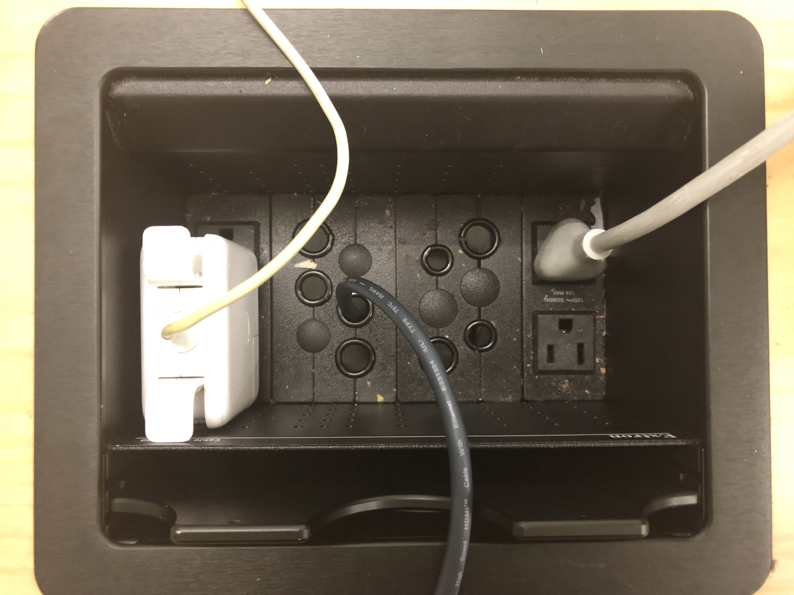

    
   This is an image of an outlet well located on a table in a Sawyer study room.

### Bad Design
Having access to chargers and outlets has become a necessary part of doing homework for almost all classes at Williams. Most Mac laptop chargers feature a large white block, as pictured above. I could critique the charger itself, but I will instead focus on the outlet. When plugged into an outlet located on a wall, the Mac chargers don't block access to the second plug because they can be plugged into the bottom, leaving the top free. This outlet is configured in such a way, however, that both plugs on one side of the well cannot be used at the same time because the charger blocks the second plug, which is very frusrating. (There is not room to turn the block to face the other direction.)

This an example of outlet design that would have been perfectly useful 10 years ago, or would still be useful if it was located on a wall. The designers of the table failed to take into account the probable use for the outlet (I am assuming that this table was manufactured after the advent of macbook chargers), or the location of the outlet.

A simple change would solve this problem. If the plugs were rotated 90 degrees, there would be room for the macbook charger blocks in the center of the well, and all outlets could be used at once. 
