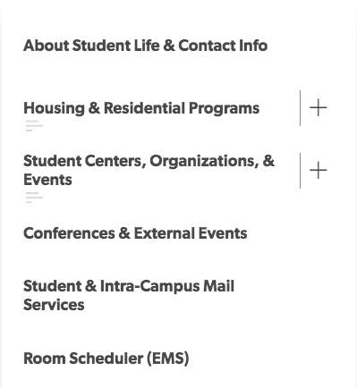

    

### Good Design

This is a screenshot of a side-bar from the student life page on the Williams website. I chose this design because the school's website should be intuitive and easy to navigate, and I expect the student life page is an especially high-traffic area of the website. 

This sidebar features many aspects of good design that are mentioned in Reichenstein's Learning to See. Notably there are two small, unobstrusive features that make navigating the bar quick and simple: the plus signs and the small graphic suggesting a list beneath those sections. Without needing explicit instructions, a user can intuit that the sections featuring a list graphic below them have subsections, and that pressing the plus-sign will expand the list. These graphics both cut away unnecessary elements of the list **and** add detail to the necessary aspects, which are two goals of good design described by Reichenstein.

The design of the list is functional without adding frills or colors that might distract from its usefulness. It is aesthetically pleasing in a simplistic way, which I think puts it in the **beautiful** design category, rather than simply the bold category.

