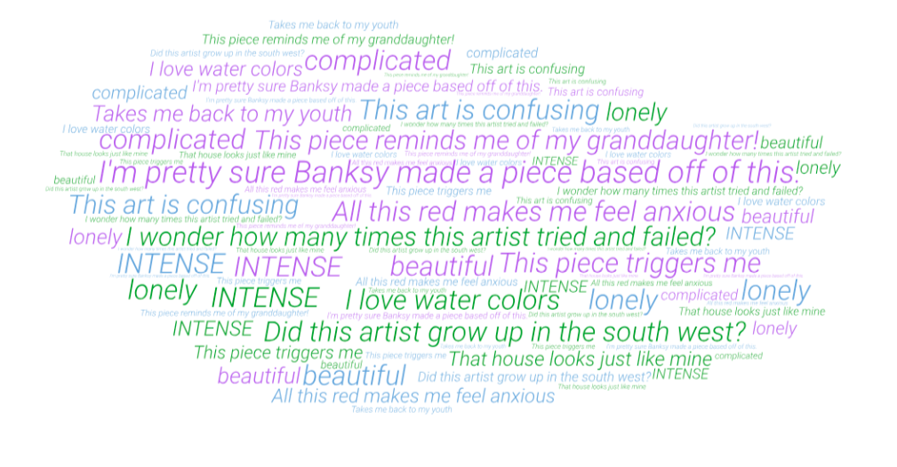

With the exception of some exhibits that specifically include music or sounds, most museums tend to be quiet spaces. Often, that quietness leads to a little bit of awkwardness. Social interactions are kept, for the most part, to whispered comments, and it often feels as though an unspoken rule is being broken when the silence is disturbed. Some museums, like MASS MoCA, have pushed back on this stereotype with programs like the Bang On A Can music festival, where artists play music around the museum in both expected and unexpected locations (in an elevator, for example). 

Noise brings life into a space immediately. And casual spoken language can make concepts clear for people who might not otherwise access them. (This is why attending lecture gives you an academic advantage over simply looking through lecture slides or a textbook.)
What if this same concept was applied to museums in a much more dynamic manner than a simple guided tour? What if the museum
visitors themselves narrated the pieces?

	
  Upon arriving at the museum, visitors have the option of picking up a LoudSpeaker, a discrete headset device that allows
  for both listening and recording. The device uses GPS location in coordination with a detailed gallery map to ascertain which piece of art the visitor is currently standing in front of. 
  
  
  
  The visitor can then record their own impression of the art: 
  an emotion, a question, a historical fact, an opinion, or any passing thought that the art brings to mind, as well as listen
  to the narration collection contributed by previous museum visitors.
  
  
  
  The quiet sanctuary of the museum is not disturbed because the headsets are extremely sensitive and can pick up on mere 
whispers. If a visitor wishes to record a louder or more impassioned narration, soundproof rooms are available for this 
purpose, and the visitor simply manually selects the artwork in the room rather than relying on the LoudSpeaker’s GPS. 
A user’s narrations are recorded in their Loud account, and they can log on later to tag their narrations as Questions, 
Opinions, History, Thoughts, or Emotions. 

The website also allows remote access the digitized artwork and narrations. 
Users can search for narrations on a particular topic and see an aggregated collection of the relevant artworks, or listen to a specific user’s collection of narrations. LoudSource brings community collaboration to the museum space, adds a social aspect to a museum visit that might otherwise be solo, and allows networking opportunities in the online platform. 

Art becomes more accessible to the visitors, and in turn the visitors *reinvigorate* art that is otherwise often static.

All narrations are held for 24 hours for review before being added to the LoudSource narration community and are screened 
for swears and offensive language, but LoudSource does respect freedom of speech and does not endorse nor censor 
certain points of view or opinions. LoudSource offers G, PG, PG-13, and R rated settings.

Images taken from the following sources:

https://www.iconfinder.com/icons/118617/mark_question_icon
https://www.iconfinder.com/icons/1654367/favorite_mark_opinion_rating_star_icon
https://www.iconfinder.com/icons/2124148/app_emotion_essential_ui_icon
https://www.iconfinder.com/icons/370072/alarm_alert_clock_event_history_schedule_time_icon
https://www.iconfinder.com/icons/925926/bubble_chat_conversation_friends_talk_icon
https://www.flickr.com/photos/plantronicsgermany/12655054665/in/photolist-khhsRF-2Qzn4a-aEcTgE-HgctS2-2oSgYj-65iUW4-eCjW9-4Jcc2s-2kz3A2-SR9Ld3-aDrDjF-27yVVQM-e5hbVm-CKov1M-UWqKvw-DEUFxz-qNtanJ-5btGYz-qULmFx-aTaQye-3oH6gU-8jNdVG-2yUWxv-JASaNH-2n3JW5-Fzf5LZ-k968uH-dNT9k6-iFeg5g-vUxVAA-JQNhjt-FCZvDi-ADwShJ-DZTPMd-iFbnUN-CE19p-8K8LHF-iLkPXa-HVM2wU-7KPyb4-q9awKy-Gb3U2n-27n94zL-AqQTGx-qb5Rts-dCBjrY-GaQpMK-3y8wMT-47xXBM-8AC7Tt
https://www.redbubble.com/people/zeeclark/works/19842562-abstract-jackson-pollock-painting-original-art-titled-jump-in
https://flamingtext.com/net-fu/jobs/25794784886308388.html
https://www.kimbellart.org/visit/plan-your-visit
https://wordart.com/create

